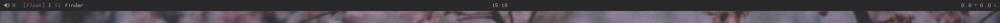

# bar.widget
[Übersicht](http://tracesof.net/uebersicht/) system information bar widget in my own colourscheme.

## Sreenshots




## Information

The nerdbar widget this is based on can be found [here](https://github.com/herrbischoff/nerdbar.widget).

`bar.coffee` is responsible for the dark gray background.

`mode-screen.coffee` requires [kwm](https://github.com/koekeishiya/kwm) to work, it fetches the current tiling mode and displays it as [float]/[bsp]/[monocle] followed by the currently active desktop (only works with 2 atm, needs to be fixed).

`mpc-volume.coffee` displays the current **mpc** volume.

`network.coffee` displays the current network traffic.

`time.coffee` displays the current time.

`window-name.coffee` displays the active window's title.

## Installation

Install [Übersicht](http://tracesof.net/uebersicht/) and [kwm](https://github.com/koekeishiya/kwm) (OPTIONAL) first, then:
```
git clone https://github.com/grassii/bar.widget $HOME/Library/Application\ Support/Übersicht/widgets/bar.widget
```
The font is called **Proggy Opti Small** and can be downloaded [here](http://www.proggyfonts.net/wp-content/download/ProggyOptiS.dfont.zip)
